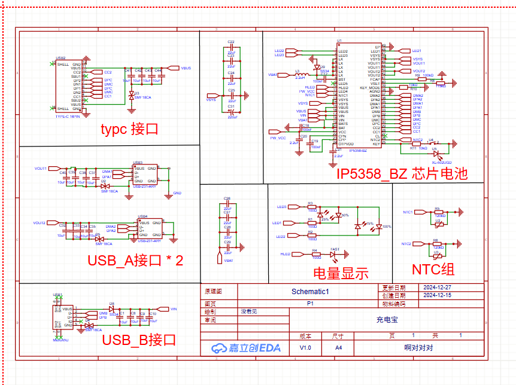
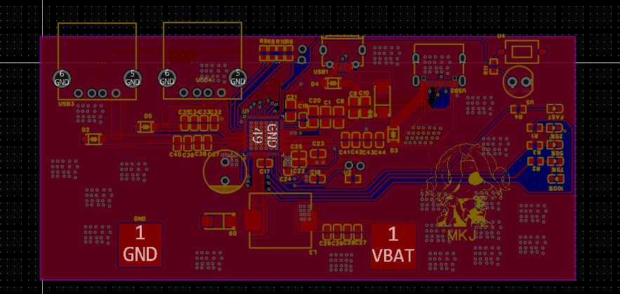
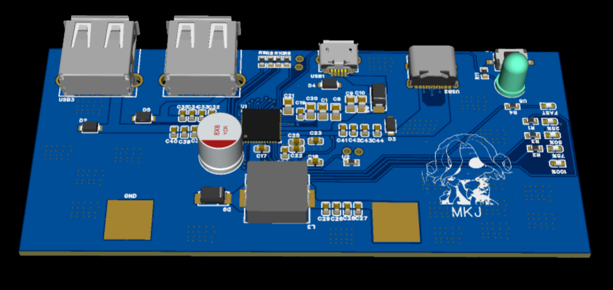
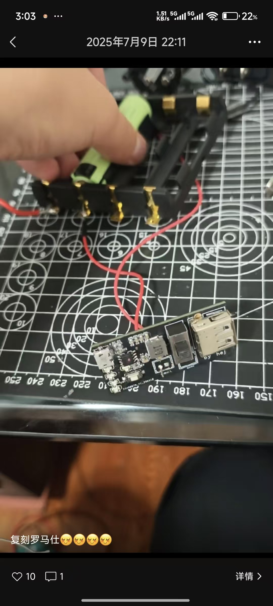
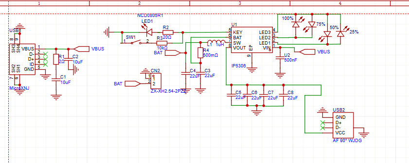
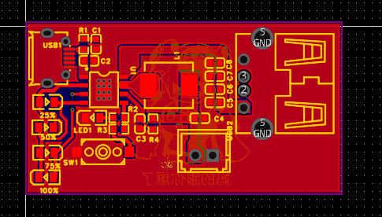
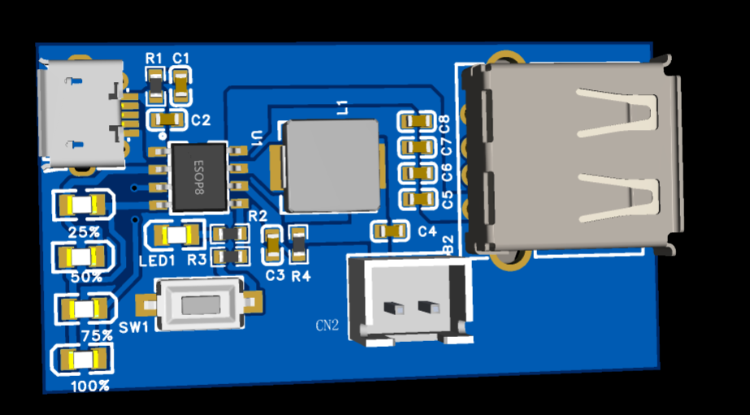

# 充电宝DIY过程

## 第一版：IP5358_BZ芯片

首先第一版我设计的使用的是ip5358_bz的芯片，但是目前有一个很大的问题就是ip5358_bz的芯片在2020已经停产了，导致的问题就是买到的ip5358的芯片全是假货，完全不能用，焊接完成之后之直接就烧。

## 第二版：IP5306芯片

第二版我才用了ip5306的芯片打算用于单片机的额外供电，结果出现了两个问题：

### 问题一：LED方向错误
第一我led画板子的画反了，导致一上电直接就烧毁，芯片非常烫。

> 可以看见电源芯片上面被击穿了

### 问题二：启动顺序问题
其中这个充电宝芯片还有第二个问题，就是这个充电宝芯片启动的时候不能直接接电源供电口，会反向击穿，一定要先接设备。

## 第三版：改进设计

接下来我设计了第三版。

### 测试结果
其中测试通过没有问题。

